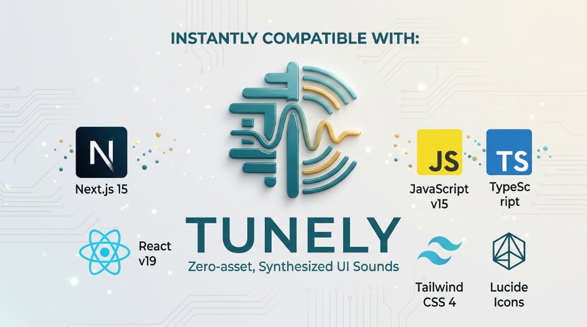

<p align="center">
  
</p>

<p align="center">
  <strong>Zero-asset, ultra-lightweight synthesized UI sound design system for modern web apps.</strong><br />
  No MP3s. No WAV files. No network latency. 100% procedural Web Audio API synthesis.
</p>

<p align="center">
  <a href="https://github.com/Mostafashadow1/tunely/blob/main/LICENSE"></a>
  
  
  
  
  
</p>

---

## 💡 Why Tunely?

Modern SaaS products (Stripe, Slack, Linear, Apple Pay) feel extraordinarily polished because of **multi-sensory micro-interactions**. When an action succeeds, auditory feedback confirms completion instantly without forcing the user to stare at a spinner or scan for a toast notification.

However, 95% of developers avoid adding audio to their web applications because:
1. **Asset Burden:** Managing `.mp3` or `.wav` files, licensing, CDN uploads, and Next.js / Vite asset path headaches.
2. **First-Play Network Lag:** Audio files must be fetched over the network; the first click sounds delayed (150–400ms lag) or misses entirely.
3. **Browser Autoplay Restrictions:** Browsers suspend audio playback unless properly unlocked on user gestures.
4. **SSR Crashes:** Libraries crash during Next.js Server-Side Rendering when `window` or `AudioContext` is undefined.

### The Tunely Solution:
* **0 KB Audio Assets:** Every chime, click, pop, and tone is synthesized procedurally in real-time using native browser oscillators and gain envelopes.
* **< 1.5 KB Bundle:** Smaller than a typical single button icon.
* **Zero Network Latency:** Sounds trigger in **under 1ms** because zero bytes are downloaded.
* **100% SSR-Safe:** Safe to import and call anywhere in Next.js (Server Components, Server Actions, Route Handlers). It gracefully acts as a silent no-op on the server.
* **Dynamic Themes:** Adjust pitch, volume, and acoustic palettes (Modern SaaS, Crystal Glass, Subtle Minimal, Bouncy Playful, Chiptune Retro) on the fly.

---

## 📦 Installation

```bash
# pnpm
pnpm add tunely

# npm
npm install tunely

# yarn
yarn add tunely

# bun
bun add tunely
```

---

## ⚡ Quick Start

### 1. Vanilla JavaScript / TypeScript
```typescript
import { tunely } from 'tunely';

// 1. Play individual cues
tunely.success(); // 🎶 Rising harmonic major chord (HTTP 200)
tunely.error();   // ⚠️ Gentle warning double-tone (HTTP 4xx/5xx)
tunely.click();   // 🖱️ Ultra-tight 25ms tactile click

// 2. Map directly from HTTP Status Code
const res = await fetch('/api/orders', { method: 'POST' });
tunely.fromStatus(res.status); // 200 -> success, 400/500 -> error, 300 -> info

// 3. Or wrap fetch automatically
const enhancedFetch = tunely.wrapFetch();
await enhancedFetch('/api/checkout'); // Plays success or error automatically!
```

---

### 2. React / Next.js Client Component
```tsx
'use client';

import { useTunely } from 'tunely/react';

export function CheckoutButton() {
  const { success, error, click } = useTunely({ theme: 'glass' });

  const handleCheckout = async () => {
    click(); // Instant tactile response on click
    try {
      await processPayment();
      success(); // Harmonic chime confirmation
    } catch (err) {
      error(); // Gentle warning alert
    }
  };

  return (
    <button onClick={handleCheckout} className="btn-primary">
      Pay Now
    </button>
  );
}
```

---

### 3. Next.js 15 Server Actions
Tunely is designed with senior-level isomorphic safety. You can trigger audio safely inside transitions or after server action resolutions:

```tsx
'use client';

import { useTransition } from 'react';
import { tunely } from 'tunely';
import { updateBillingAction } from '@/actions/billing';

export function BillingSettings() {
  const [isPending, startTransition] = useTransition();

  const handleUpdate = (formData: FormData) => {
    tunely.click();
    startTransition(async () => {
      const response = await updateBillingAction(formData);
      if (response.success) {
        tunely.success();
      } else {
        tunely.error();
      }
    });
  };

  return (
    <form action={handleUpdate}>
      {/* Inputs */}
      <button disabled={isPending}>Save Billing</button>
    </form>
  );
}
```

---

### 4. Sonner & Shadcn UI Toasts Integration
Create a sound-enhanced toast helper with just 10 lines of code:

```typescript
import { toast as baseToast } from 'sonner';
import { tunely } from 'tunely';

export const toast = {
  success: (message: string) => {
    tunely.success();
    return baseToast.success(message);
  },
  error: (message: string) => {
    tunely.error();
    return baseToast.error(message);
  },
  warning: (message: string) => {
    tunely.warning();
    return baseToast.warning(message);
  },
  info: (message: string) => {
    tunely.info();
    return baseToast.info(message);
  },
};
```

---

### 5. Vue 3 (Composition API)
```vue
<script setup>
import { tunely } from 'tunely';

async function handleSave() {
  tunely.click();
  try {
    await saveDocument();
    tunely.success();
  } catch {
    tunely.error();
  }
}
</script>

<template>
  <button @click="handleSave">Save Changes</button>
</template>
```

---

## 🎵 Sound Catalog

All sounds are synthesized procedurally using precision oscillators and exponential ADSR envelopes:

| Method | Musical Profile | Ideal Use Case |
| :--- | :--- | :--- |
| `tunely.success()` | Rising major chord (C5 -> E5 -> G5) | HTTP 200 OK, form saved, mutation done |
| `tunely.error()` | Gentle dissonant drop (E4 -> C4) | HTTP 4xx/5xx, form validation failed |
| `tunely.warning()` | Dual-tone presence ping (A4 -> C#5) | Unsaved changes, confirmation alerts |
| `tunely.info()` | Soft crisp sine chime (E5 / 659 Hz) | Notification badge, tooltip, incoming message |
| `tunely.click()` | Micro-transient tactile click (25ms) | Primary buttons, tabs, segmented controls |
| `tunely.pop()` | Upward frequency sweep (380 -> 950 Hz) | Modals opening, dropdown menus, badges |
| `tunely.toggle(active)` | Dynamic switch (Rises for ON, drops for OFF) | Toggle switches, checkboxes, theme toggle |
| `tunely.delete()` | Descending muted tone (G4 -> D4) | Trash actions, item removed, discard draft |
| `tunely.glass()` | High-Q resonant crystal chime (C6) | Premium rewards, milestone unlocks, payments |
| `tunely.bubble()` | Liquid droplet modulation | Likes, hearts, reactions, bookmarking |

---

## 🎨 Sound Themes (Palettes)

Switch soundscapes globally or per sound invocation:

* **`modern`** *(Default)*: Clean, balanced, elegant harmonics tailored for SaaS applications.
* **`glass`**: Apple-like crystal shimes and resonant crystalline textures.
* **`minimal`**: Subtle micro transients with zero auditory fatigue.
* **`playful`**: Bouncy, rounded curves for games, social, or consumer products.
* **`retro`**: Chiptune 8-bit square waves for arcade-style nostalgia.

```typescript
// Per-sound theme override
tunely.success({ theme: 'glass', volume: 0.8 });

// Global theme configuration
tunely.setTheme('minimal');
```

---

## 🤖 AI Prompts Hub (Cursor, Claude, v0, Antigravity)

Use these copy-paste prompts with your AI assistant to instrument your application in seconds:

<details>
<summary><strong>Prompt: Integrate with Sonner / Shadcn UI Toasts</strong></summary>

```text
Please integrate the 'tunely' library into my React/Next.js project.
Wrap my toast notification helper (Sonner / Shadcn UI) so that:
- toast.success() plays tunely.success()
- toast.error() plays tunely.error()
- toast.warning() plays tunely.warning()
- toast.info() plays tunely.info()
Ensure it is 100% SSR-safe and works seamlessly inside client components.
```
</details>

<details>
<summary><strong>Prompt: Sound Feedback for Forms and Mutations</strong></summary>

```text
Please enhance my form submissions using 'tunely':
1. When the user clicks the submit button, trigger tunely.click()
2. If the mutation or API response succeeds (HTTP 200), play tunely.success()
3. If the form validation fails or the server returns an error, play tunely.error()
Import { tunely } from 'tunely' and keep all audio calls strictly client-side.
```
</details>

<details>
<summary><strong>Prompt: Automatic Fetch / Axios Status Interceptor</strong></summary>

```text
Configure an API response interceptor using 'tunely':
- Status 2xx -> tunely.fromStatus(res.status)
- Status 4xx / 5xx -> tunely.fromStatus(res.status)
Ensure non-blocking execution and graceful handling across all endpoints.
```
</details>

---

## 📊 Benchmark & Comparison

| Feature | MP3 / WAV Assets | Base64 Inlining | Tunely (Web Audio API) |
| :--- | :--- | :--- | :--- |
| **Audio File Size** | 50 KB – 300 KB+ | 30 KB – 80 KB | **0 KB (Zero assets!)** |
| **JS Library Size** | ~15 KB + assets | ~40 KB + assets | **< 1.5 KB (gzipped)** |
| **First Play Latency** | 150ms – 400ms | 10ms | **< 1ms (Instant)** |
| **HTTP Requests** | 1 per sound file | 0 | **0** |
| **SSR Compatibility** | Throws on `window` | Throws on `window` | **100% Isomorphic Safe No-op** |
| **Dynamic Pitch & Themes** | Requires new audio files | Requires new audio files | **Realtime mathematical control** |

---

## 🛠️ Monorepo Structure

```text
tunely/
├── packages/
│   └── tunely/           # Core library (NPM: tunely)
│       ├── src/
│       │   ├── core/     # AudioEngine, AudioContext singleton, Autoplay unlocker
│       │   ├── presets/  # Procedural synthesizers (success, error, click, etc.)
│       │   ├── react/    # useTunely hook & TunelyProvider
│       │   └── utils/    # SSR safety guards & Fetch status wrappers
│       └── tests/        # Vitest suite
└── apps/
    └── website/          # Next.js 15 interactive documentation & soundboard
```

---

## 📄 License

MIT © [Mostafa Mohamed Abdalla](https://github.com/Mostafashadow1)
